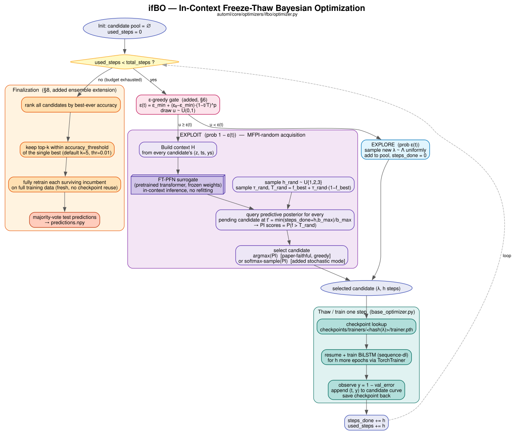
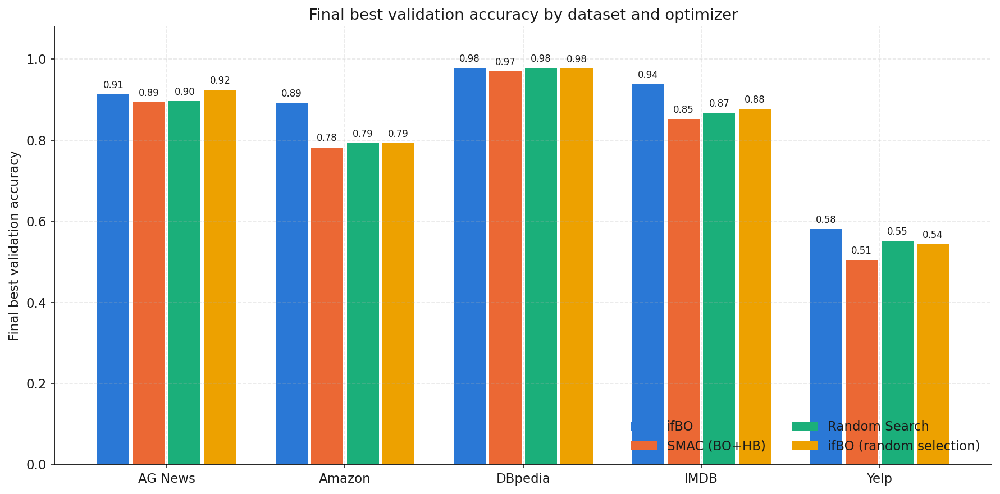
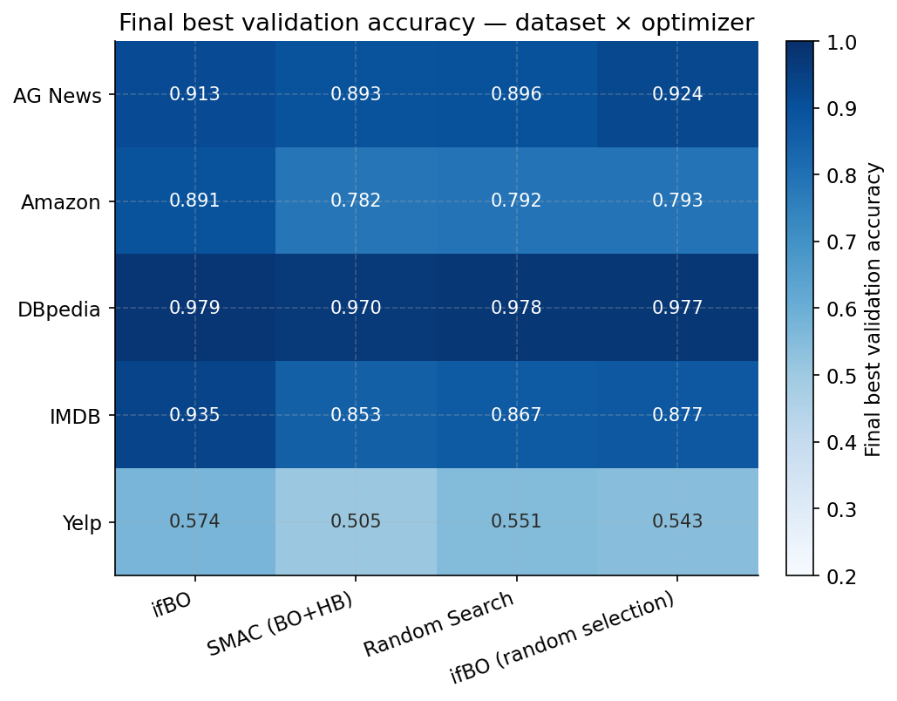
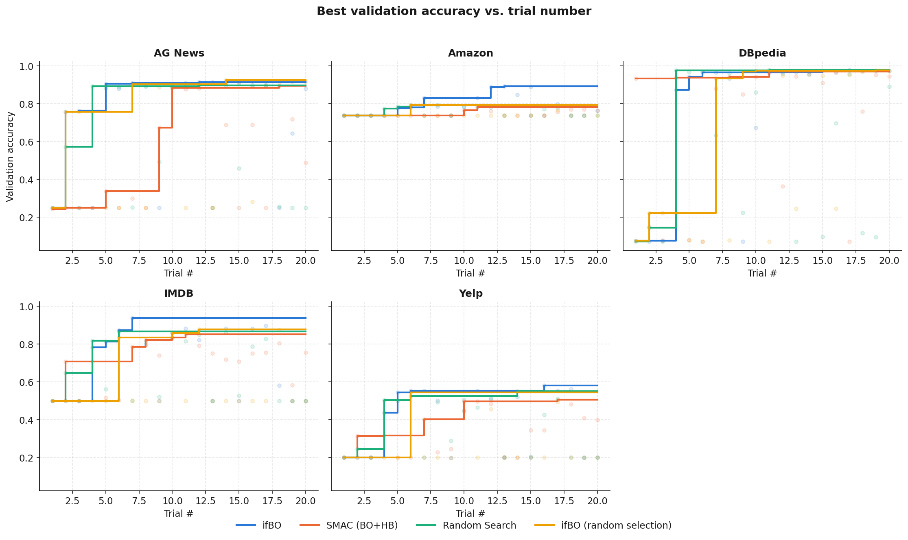
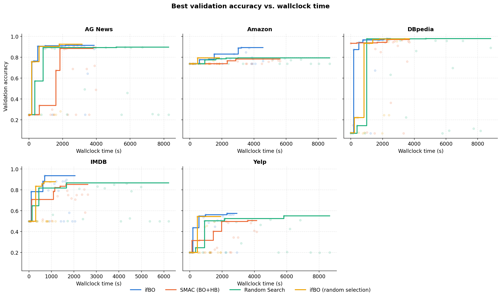
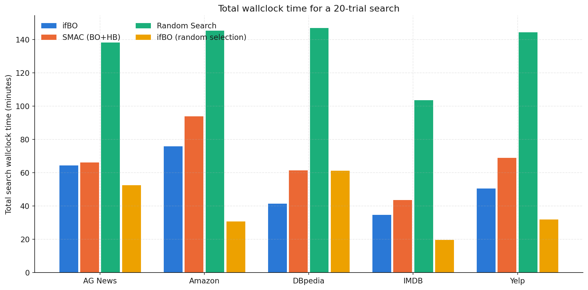
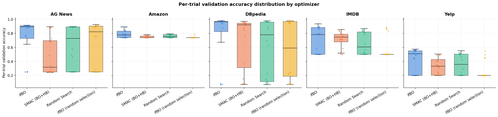
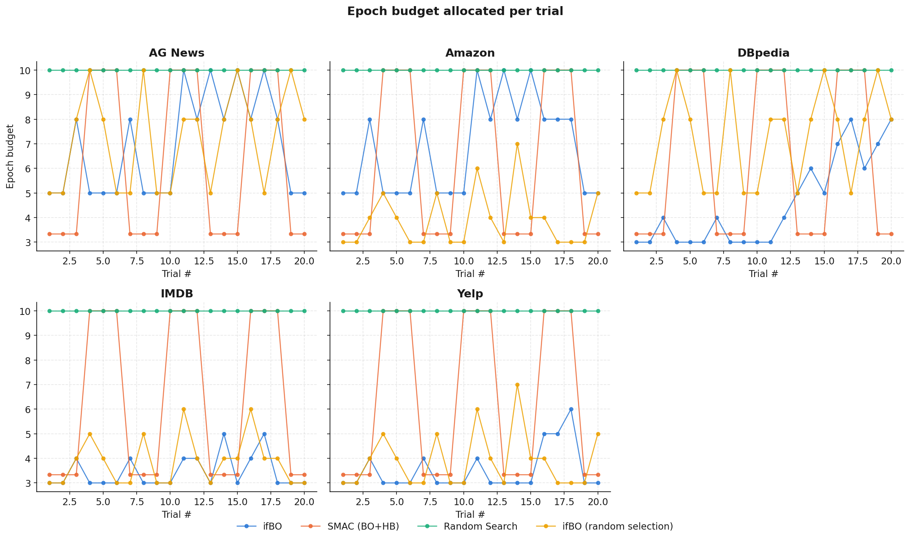
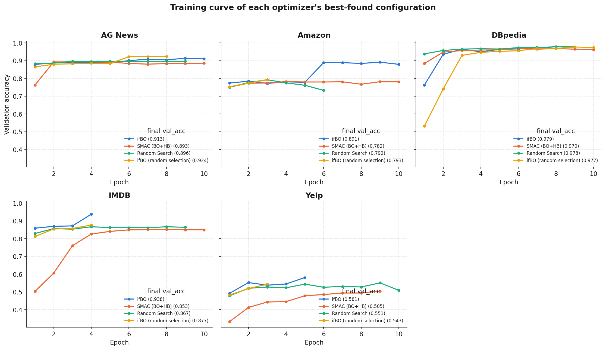

## Problem formulation: freeze-thaw hyperparameter optimization

Let $\Lambda$ be a hyperparameter search space and $f(\lambda, b)$ the performance (validation
accuracy, in this project) of configuration $\lambda \in \Lambda$ after being trained for $b$ discrete
training steps (epochs, here). A configuration's *learning curve* is the sequence
$\{f(\lambda, 1), f(\lambda, 2), …\}$ as $b$ grows.

Freeze-thaw HPO relaxes the usual "pick a config, train it to completion, observe one
number" protocol. Instead, resources are spent **incrementally**: at every iteration
the optimizer either **thaws** (resumes/continues) a previously partially-trained,
currently-frozen configuration for one more step, or starts a brand-new configuration.

Formally, the goal is to find a resource allocation that maximizes

$$
\max_{\lambda \in \Lambda,\ 1 \le b \le b_\lambda} f(\lambda, b)
$$
subject to

$$
N = |\{\text{decisions made}\}| \le B, \qquad
b_\lambda^{\min} \le\  b_\lambda \le b_\lambda^{\max}, \qquad 
\forall\, \lambda \in \Lambda \ \text{with } b_\lambda > 0, \qquad
b_\lambda \in \mathbb{Z}_{\ge 0}, \qquad 
\forall\, \lambda \in \Lambda
$$

- a total trial budget, $B$ - the number of freeze/thaw decisions the optimizer is allowed to make.
- $b_\lambda^{\min}$ and $b_\lambda^{\max}$ - per-configuration epoch bounds that prevent premature judgments on too 
little training and wasted spend on configs that have already converged.

## The FT-PFN surrogate

Rather than fitting a Gaussian Process or random forest online (as SMAC/BOHB do), ifBO
uses **FT-PFN**, a *Prior-data Fitted Network*: a transformer trained once, offline, on
large quantities of **synthetic** learning-curve data sampled from a hand-designed
prior, and then used purely for inference at HPO time via **in-context learning** — no
weights are updated during the actual HPO run.

The implementation follows **ifBO** as introduced in:

> H. Rakotoarison, S. Adriaensen, N. Mallik, S. Garibov, E. Bergman, F. Hutter.
> *In-Context Freeze-Thaw Bayesian Optimization for Hyperparameter Optimization.*
> ICML 2024. [arXiv:2404.16795](https://arxiv.org/abs/2404.16795)

### What the surrogate models

FT-PFN approximates the posterior predictive distribution

$$
p( f(\lambda_\text{test}, b_\text{test}) \mid \lambda_\text{test}, b_\text{test}, H )
$$

i.e., "given everything observed so far about *other* (and this) configurations'
partial learning curves, what is the distribution over this configuration's performance
at some future training step $b_\text{test}$?" The set $H$ is passed to the network as a sequence
of tokens (its **context**) at inference time; the transformer's attention mechanism
implicitly performs Bayesian updating over this context in a single forward pass,
rather than through iterative model refitting. This is what makes each acquisition
query cheap enough to run every freeze-thaw step (the paper reports 10–100× speedups
over refitting-based gray-box surrogates such as DPL and DyHPO).

## Acquisition function: MFPI and MFPI-random

### 5.1 The paper's definition

Multi-fidelity Probability of Improvement, as defined in the paper (Eq. 3):

$$
\operatorname{MFPI}(\lambda; h, T) = P( M(\lambda, \min(b_\lambda + h, b_\max)) > T )
$$

— the surrogate-predicted probability that configuration $\lambda$, if thawed for $h$ more
steps, would exceed a target performance $T$. Two "hyper-hyperparameters" govern it: the
lookahead horizon $h$ and the improvement target $T$. Rather than fixing these, the paper
proposes **MFPI-random** (Eq. 4), redrawing both **every single freeze-thaw iteration**:

$$
\begin{align*} 
\operatorname{MFPI-random}(\lambda) &= \operatorname{MFPI}(\lambda; h_\text{rand}, T_\text{rand}) \\
h_\text{rand}        &\sim U(1, b_\max) \\
T_\text{rand}        &= f_\text{best} + \tau_\text{rand} · (1 − f_\text{best}) \\
\log_{10}(\tau_\text{rand}) &\sim U(−4, −1)
\end{align*}
$$

where $f_\text{best}$ is the best performance observed so far. This amounts to sampling an
acquisition function from an implicit *portfolio* of MFPI instances at every step,
which the paper's ablations _(Figure 4)_ show is necessary — fixed-horizon or
fixed-threshold variants, and standard Expected Improvement paired with FT-PFN's
heavy-tailed posteriors, both underperform substantially.

## A growing the candidate pool

The paper's Algorithm 1 (see §7 for the literal loop) is stated over the *whole* search
space $\Lambda$ implicitly — at each iteration the acquisition is (conceptually) maximized over
all $\lambda \in \Lambda$, which naturally lets brand-new, never-tried configurations compete against
partially-trained ones for being selected next.

This implementation instead maintains an **explicit, dynamically growing list** of candidates
(starting empty), and layers an **explicit decaying $\epsilon$-greedy exploration floor** on top
of MFPI-random rather than substituting for it:

$$
\begin{align*}
\epsilon(t) = \epsilon_{\min} + (\epsilon_0 - \epsilon_{\min}) \cdot \left(1 - \frac{t}{T}\right)^p.\\
\text{where } \qquad \epsilon_{\min} = 0.05, \quad p = 2, \quad T = N
\end{align*}
$$

$\epsilon_0$ (`ifbo_initial_epsilon`, default $1.0$) means the very first steps are pure
exploration — with an empty/small pool there's nothing meaningful yet for MFPI-random to
discriminate between — decaying polynomially toward a floor of $0.05$ so some unconditional
exploration always remains, even late in the run. Each iteration then branches:

- **With probability $\epsilon(t)$** (the exploration floor): a brand-new configuration is
  sampled uniformly from $\Lambda$, added to the pool with zero observations, and selected
  directly — bypassing the surrogate entirely.
- **With probability $1-\epsilon(t)$** (an exploitation round): the *pending* pool (candidates
  not yet at $b_\max$, minus any already claimed earlier in the same parallel batch) is assembled, 
  **plus one additional fresh configuration** sampled
  uniformly from $\Lambda$ for this round only. MFPI-random ($h_\text{rand}, T_\text{rand}$
  redrawn as in §5.1) then scores *every* contender — pending and fresh alike — against the
  FT-PFN context in a single batched query, and either takes the arg max
  (`ifbo_greedy_candidate_selection`) or samples from a softmax over the PI scores. The fresh
  candidate is only appended to the persistent pool if it *wins* this round; otherwise it is
  discarded and never referenced again. A `ifbo_use_random_selection` flag swaps this scoring
  step for a uniform choice among the same contenders (pending + fresh), which is what backs
  the "freeze-thaw random" baseline (see Results, below). 
  **TODO: Add some experiment results for greedy and softmax methods**

One more rule guards the exploitation branch: once the current best-so-far candidate has
accumulated at least `ifbo_incumbent_exclusion_min_observations` (default $2$) freeze-thaw
steps, it is temporarily dropped from the pending pool for that round. Left unchecked, it tends
to keep re-winning $\mathrm{PI}(T_\text{rand})$ against its own already-confirmed best (since
$T_\text{rand}$ sits just above $f_\text{best}$), sinking budget into repeatedly re-thawing
itself instead of advancing or discovering other candidates.

**This layer is a deliberate engineering addition, not part of the published ifBO method.** It
exists because this implementation manages a discrete, growing candidate list rather than
treating "propose a new $\lambda$" as one more option scored unconditionally by the same
acquisition function every round — doing so on *every* round would grow the pool (and hence the
FT-PFN context) without bound. Note, though, that a fresh candidate *is* scored against the
surrogate on every exploitation round, competing on the same $\mathrm{PI}(T_\text{rand})$ scale
as pending candidates for a chance to enter the pool; the surrogate is only fully bypassed on
the explicit $\epsilon(t)$-floor rounds, which exist to guarantee a baseline injection rate of
new configurations independent of what the surrogate currently believes.

## Search space: the `sequence-dl` approach

`sequence-dl` (`automl/core/approaches/sequence_dl.py`) is a BiLSTM-with-attention text
classifier trained **from scratch** — no fine-tuning of a pretrained encoder — so its search
space, defined in `build_config_space(fixed_model_type="sequence-dl")`
(`automl/core/configspacehelper.py`), has to cover both generic optimization knobs and the
architecture of a recurrent encoder built from nothing. $\Lambda_\text{sequence-dl}$ splits into
two groups: hyperparameters shared with `transformer` (consumed generically by `TorchTrainer`
and the data pipeline) and hyperparameters specific to the BiLSTM.

**Shared hyperparameters** (both approaches sample these; ranges below are shared, defaults
only sometimes differ per-approach):

| Hyperparameter | Range | Default | Why |
|---|---|---|---|
| `dropout` | $[0.0, 0.5]$ | $0.2$ | Regularizes the classifier head / recurrent stack. Trained-from-scratch models overfit faster than fine-tuned ones on the same subsampled trial data, so the upper bound is pushed higher than would be sensible for `transformer`. |
| `weight_decay` | $[10^{-6}, 10^{-2}]$, log | $10^{-4}$ | Standard L2 regularization; log-scaled since its effect is roughly multiplicative over orders of magnitude, not additive. |
| `scheduler` | {`steplr`, `cosineannealinglr`, `exponentiallr`, `reducelronplateau`} | `cosineannealinglr` | Nothing in the training loop favors one LR schedule a priori across five very different datasets/sizes; exposed as a categorical so the optimizer (SMAC/ifBO) picks empirically rather than the schedule being hand-fixed. |
| `batch_size` | $[32, 512]$, log | $64$ | Log-scaled because batch size trades off gradient noise against step count roughly log-linearly; the wide upper range matters more for `sequence-dl` since a from-scratch BiLSTM is cheap enough per-example to benefit from large batches, unlike a full transformer forward/backward. |
| `max_seq_length` | $[64, 256]$, log | $128$ | Bounds both compute (LSTM cost is linear in sequence length after packing, see below) and how much of a long document is even visible to the model; log-scaled so short/long regimes get comparable sampling density. |
| `warmup_ratio` | $[0.0, 0.2]$ | $0.1$ | Fraction of total steps spent on linear LR warmup before the main schedule kicks in — guards against the early, high-variance gradients typical of a randomly-initialized model (the embedding layer here is warm-started, but the LSTM and attention weights are not). |

**`sequence-dl`-specific hyperparameters**:

| Hyperparameter | Range | Default | Why |
|---|---|---|---|
| `hidden_dim` | $[32, 256]$, log | $128$ | LSTM hidden size per direction (the model is always bidirectional, so the pooled representation is $2\times$ this). Log-scaled since capacity/compute trade off multiplicatively; the range spans "cheap enough to try dozens of trials" to "enough capacity to fit the harder datasets (`yelp`, `amazon`)". |
| `learning_rate` | $[10^{-4}, 10^{-2}]$, log | $10^{-3}$ | An order of magnitude higher than `transformer`'s range ($[10^{-5}, 5\times10^{-5}]$): everything downstream of the embedding layer is trained from scratch here, so it needs the larger step sizes typical of from-scratch supervised training rather than the small ones fine-tuning requires to avoid catastrophic forgetting. |
| `optimizer` | {`adam`, `adamw`, `sgd`} | `adamw` | `sgd` is only a sane choice for a shallow from-scratch model like this (it would badly under-perform fine-tuning a transformer, so `transformer`'s search space excludes it); `adamw`/`adam` cover the common default choices. |
| `seq_embed_dim` | $[32, 512]$, log | $128$ | Token embedding dimensionality. Independent of any pretrained encoder's native hidden size on purpose — see `seq_pretrained_model_name` below for how a mismatch against the source embedding matrix is handled. |
| `seq_num_layers` | $[1, 3]$ | $1$ | Stacked LSTM layers. Kept shallow (max 3) because a from-scratch recurrent stack is harder to optimize as it deepens (vanishing gradients through both time and depth), and because HPO wall-clock is a hard constraint (§ Results) — depth is one of the more expensive ways to spend that budget for the accuracy it typically buys on these datasets. |
| `seq_pretrained_model_name` | {`distilbert-base-uncased`, `bert-base-uncased`, `google/bert_uncased_L-4_H-512_A-8`, `microsoft/xtremedistil-l6-h256-uncased`} | `distilbert-base-uncased` | Does **not** select a fine-tuned backbone (`sequence-dl` never runs one) — it picks which pretrained model's **WordPiece tokenizer and token-embedding matrix** warm-start the from-scratch BiLSTM. The tokenizer and embedding source are always the same model, since the BiLSTM's vocab indices must line up with whichever embedding matrix seeds it. When the chosen model's native embedding dimensionality doesn't match the sampled `seq_embed_dim`, the embedding matrix is PCA/SVD-projected down (or randomly padded up) to fit — see `_pretrained_embedding_init` in `sequence_dl.py` — which preserves the directions of highest variance in the pretrained embedding space instead of discarding the warm start entirely. |

Two omissions are deliberate, not oversights: `max_grad_norm` (gradient-clipping threshold) is
fixed by CLI/config default rather than tuned — it's a stability safeguard, not an accuracy
lever, so putting it in $\Lambda$ would spend trials on a dimension unlikely to move the metric.
And unlike `transformer`, there is no `freeze_ratio`-equivalent knob: nothing is pretrained
end-to-end here to freeze in the first place, only the embedding matrix, and that is warm-started
rather than frozen.

## Methodology




## Results

Budget:

```yaml
max_budget: 10
min_budget: 3
n_trials: 20
```

### Baselines

Three baselines, each isolating a different piece of what makes the flagship method work —
every one answers a specific "would doing less still work?" question rather than just being an
arbitrary point of comparison:

- **Random Search** (`--optimizer random`) — no multi-fidelity behavior at all: every trial
  samples a fresh configuration uniformly from $\Lambda$ and trains it straight through to
  `max_budget` epochs before it's ever compared against anything else. It never resumes a
  partially-trained config and never cuts a bad one short. This is the floor every other method
  has to beat to justify its extra machinery, and it also sets an upper bound on wall-clock cost
  per trial, since it always pays for the *full* epoch budget regardless of how a config is
  doing partway through (see the wall-clock comparison below — this is exactly why its bars are
  tallest everywhere).
- **SMAC (BO+HB)** (`--optimizer smac`) — SMAC3's random-forest-surrogate Bayesian
  optimization, paired with a Hyperband intensifier for multi-fidelity scheduling (successive
  halving: only the top fraction of configs at each rung's budget get promoted to the next,
  larger one). This isolates what a *classical, non-neural* multi-fidelity method achieves under
  the same epoch-budget range as ifBO — the fairest like-for-like comparison against the
  flagship method, since both get to allocate budget adaptively instead of uniformly, but SMAC
  does it with a random-forest-EI surrogate and a handful of *discrete* Hyperband rungs, instead
  of FT-PFN's in-context transformer and *continuous* freeze-thaw (visible directly in the
  fidelity-allocation figure below: SMAC's budget trace is a coarse two-level sawtooth, ifBO's
  is a much finer staircase).
- **ifBO (random selection)** — runs the *exact same* freeze-thaw pipeline and candidate-pool
  machinery as the flagship method (checkpoint resumption, the epsilon-floor exploration
  schedule, the incumbent-exclusion rule — see "Growing the candidate pool" above), but with
  `ifbo_use_random_selection=True`: FT-PFN's MFPI-random scoring is swapped for a uniform random
  choice among that round's contenders (pending candidates + one fresh proposal). This is the
  most targeted ablation of the three — everything about *how much* budget is spent
  incrementally vs. upfront is held identical to the flagship run, so any gap between this and
  full ifBO isolates the value of the *surrogate's guidance specifically*, separate from the
  value of freeze-thaw scheduling in general.


### Testbed Results

All four methods below were run under a **matched budget** (`n_trials=20`, `min_budget=3`,
`max_budget=10` epochs, `sequence-dl`/BiLSTM search space) across all five datasets —
`ag_news`, `amazon`, `dbpedia`, `imdb`, and the held-out exam set `yelp`. Numbers are
**best validation accuracy** (`1 - min(val_error)`) reached anywhere in the run, i.e. search
quality, not a held-out test score. Raw histories are in `sample-results/all_results/`; the
figures below are regenerated straight from those `.jsonl` files (see
`sample-results/final_results_analysis.ipynb`).

#### Final best validation accuracy

| Dataset | ifBO | SMAC (BO+HB) | Random Search | ifBO (random selection) |
|---|---|---|---|---|
| AG News | 0.9135 | 0.8935 | 0.8965 | **0.9245** |
| Amazon | **0.8915** | 0.7820 | 0.7925 | 0.7930 |
| DBpedia | **0.9785** | 0.9700 | 0.9780 | 0.9770 |
| IMDB | **0.9355** | 0.8525 | 0.8670 | 0.8770 |
| Yelp | **0.5735** | 0.5050 | 0.5510 | 0.5435 |

The full ifBO (FT-PFN-guided) surrogate wins on 4 of 5 datasets, with the largest margins on
the hardest tasks — Amazon (+9.9pp over the best baseline) and Yelp (+2.3pp over Random, +6.9pp
over SMAC). On AG News, its own random-selection ablation edges it out (92.45% vs. 91.35%) —
on the easiest dataset in the suite (all methods clear 89%), the FT-PFN surrogate's
acquisition doesn't have much signal to exploit over unguided freeze-thaw scheduling, so the
two land within noise of each other. Everywhere else, guided candidate selection is what
separates ifBO from its own ablation.



The bar chart above puts all four methods side by side per dataset — read it for *magnitude* of
the gaps (Amazon and Yelp show real daylight between ifBO and everything else; AG News and
DBpedia show all four methods bunched within a couple of points). The heatmap below is the
same numbers, but its shading makes the two structurally different failure/success stories in
this table pop out immediately: DBpedia's whole row is uniformly dark (97–98% for *every*
method) — with `max_budget=10` epochs, this dataset is close to saturated for the `sequence-dl`
search space, so there's little room for any optimizer to differentiate itself. Yelp's row is
uniformly the lightest (50–57%) — every method tops out well below where it lands on the other
four datasets, so Yelp is a genuinely harder classification problem at this fidelity budget,
not just a dataset where the optimizer happened to do badly.



#### Sample efficiency and wall-clock cost

Freeze-thaw's structural advantage shows up earliest here: both ifBO variants pull ahead of
Random/SMAC within the first 5–7 trials on every dataset, because a handful of thaw steps into
one promising candidate teach the surrogate (or even just the epsilon-floor exploration alone)
more than one epoch each spent across many never-revisited configs. The step lines below are
the running best-so-far incumbent; faint dots are every individual trial actually sampled, so
the vertical spread of dots at a given x tells you how much the optimizer is still gambling on
long shots even after it's found something good. SMAC's characteristic pattern is a late, sharp
jump once a Hyperband rung promotes a strong config (e.g. AG News, Yelp around trial 9–11) —
it's blind to that config's promise until the rung boundary says to check on it again, unlike
ifBO's much smoother, earlier climb.



Against wallclock time, the same curves stretch out very differently per method: Random
Search's step lines are the ones still moving at 6,000–9,000s, since every single trial (good or
bad) costs it a full `max_budget`-epoch training run — it simply hasn't finished sampling yet
by the time the freeze-thaw methods have already converged and gone flat (both ifBO variants
plateau by roughly 2,000–4,000s on every dataset).



Wall-clock tells a second story on its own: Random Search's fixed per-trial budget means it
consistently takes 2–4x longer than either ifBO variant for a 20-trial run (e.g. ~147 vs. ~41
minutes on DBpedia, ~144 vs. ~49 on Yelp), without a corresponding accuracy payoff. A subtler
gap sits between the two ifBO variants themselves: the random-selection ablation (yellow) is
consistently a few minutes faster than the full surrogate-guided run (blue) on every dataset
despite following an identical freeze-thaw training schedule — the difference is pure FT-PFN
inference overhead, one batched forward pass through the surrogate on every exploitation round,
which the ablation skips entirely by picking uniformly at random instead.



#### Where the budget goes

The per-trial accuracy distribution below shows *every* sampled trial, not just the incumbent —
a tighter, higher box means an optimizer is spending steps on consistently good configs rather
than wasting them on poor ones. ifBO's box (blue) is the tightest and highest of the four on
most datasets, direct evidence that surrogate-guided selection is concentrating repeat thaws on
configs already known to be good rather than spending them on fresh gambles. Random's and
SMAC's boxes are consistently the widest, spanning from floor accuracy up to their max — both
are still spending real trials on poor draws this late into the search, since neither can
`thaw`-revisit a specific promising config on demand the way freeze-thaw can. IMDB is the one
place the random-selection ablation shows an unusual, distinctly bimodal box: a tight band
pinned near 0.5 (chance accuracy for this binary task) with only two or three outlier points up
near 0.85. Without the surrogate to tell it which pending candidate is worth continuing, the
ablation ends up mostly sampling brand-new, barely-trained candidates that sit at the floor,
only occasionally getting lucky enough to land on (and keep thawing) one that's actually good.



The epoch-budget plot makes the *shape* of each method's multi-fidelity policy visible directly,
trial by trial. Random Search is a flat ceiling line at `max_budget` by construction — it has no
multi-fidelity policy. SMAC's Hyperband intensifier produces a coarse, almost binary sawtooth
that only ever touches two values (~3.3 and 10 epochs) — at this budget range the successive-
halving bracket only has two rungs, so a config is either killed at the bottom rung or promoted
straight to the top one, with nothing in between. Both ifBO variants instead walk the *entire*
epoch grid (4, 5, 6, 7, 8, 9, …) — the direct visual signature of literal one-step-at-a-time
freeze-thaw: a config is thawed for one more increment, re-evaluated, and only then is the next
decision made, rather than being judged at a small number of fixed checkpoints.



Finally, the training curve of each method's single best-found configuration per dataset — this
is the one figure that shows *within-run* learning-curve shape rather than across-trial search
behavior. Two patterns stand out. On Amazon, ifBO's curve is flat around 0.78 for its first five
plotted epochs, then jumps sharply to ~0.89 and stays there — a late "breakthrough" thaw step on
a config that looked merely average early on, exactly the kind of curve MFPI-random's
lookahead-horizon sampling ($h_\text{rand}$) is designed to keep chasing instead of giving up on
a slow starter. On IMDB, ifBO's best config reaches 0.935 in just 4 epochs and its curve stops
there (that's all the budget it was ever thawed for), while SMAC's best config needs the full 10
epochs to climb to only 0.853 — a smaller number reached with more than double the training
cost, since freeze-thaw was able to recognize this config's quality early and never needed to
push it further.


